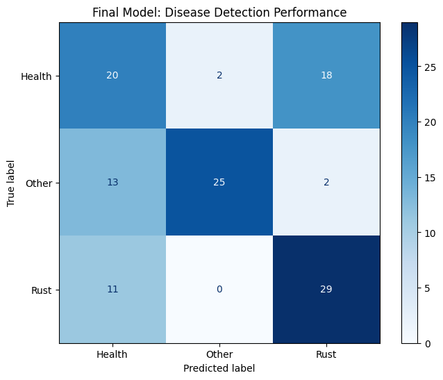

# AIforAgriculture2026Task1
This is a part of the challenge focuses on developing innovative deep learning algorithms using extensive multi/hyperspectral and satellite remote sensing datasets across two main tasks of which this is the first one.
The developed model has a accuracy of 70% .

However the baseline model shows 54.2% accuracy
